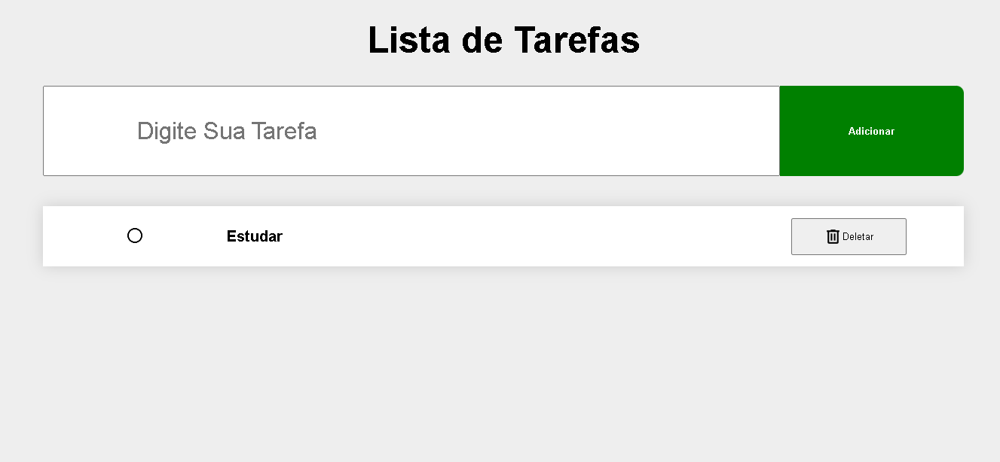

# 📝 Projeto Lista de Tarefas

Um projeto simples e funcional de lista de tarefas desenvolvido com **HTML**, **CSS** e **JavaScript puro**, com o objetivo de praticar manipulação do DOM e lógica de programação.

🔗 **Acesse o projeto online:** [Clique aqui](https://eduardofontainha.github.io/projeto-lista-de-tarefas/)

---

## 🚀 Funcionalidades

- Adicionar novas tarefas
- Remover tarefas
- Marcar tarefas como concluídas
- Interface simples e responsiva

---

## 💡 Tecnologias Utilizadas

- HTML5  
- CSS3  
- JavaScript

---

## 🧠 Aprendizados

Durante o desenvolvimento deste projeto, pratiquei:
- Manipulação do DOM 
- Lógica com arrays e funções
- Organização do código e boas práticas de legibilidade
- Deploy de um projeto no **GitHub Pages**

---

## 📸 Demonstração

 

---

## 📂 Como Executar Localmente

```bash
# Clone este repositório
git clone https://github.com/Eduardofontainha/projeto-lista-de-tarefas.git

# Acesse a pasta do projeto
cd projeto-lista-de-tarefas

# Abra o arquivo index.html no navegador
